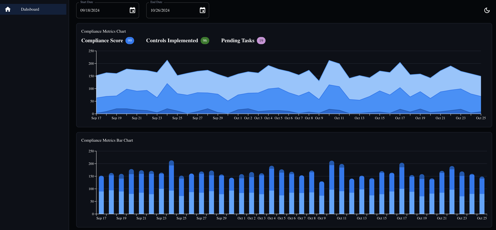

# conformity-dashboard

## Description
The dashboard calling backend REST API to fetch metrics and there are 2 chart one is metrics linear chart and the other is the bar chart, you can use datepicker to check other day range of metrics.
Also the theme can change from dark -> light or your system default



## Backend
* Start running
```
npm run start
```
* test
```
npm run test
```

## Frontend
* Start running
```
npm run start
```
* test
```
npm run test
```